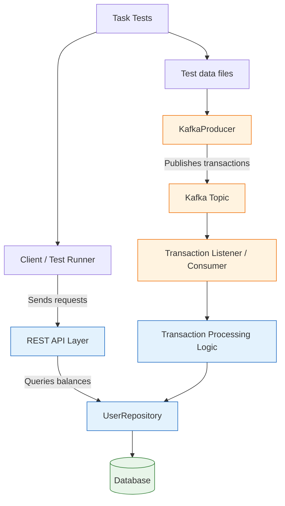
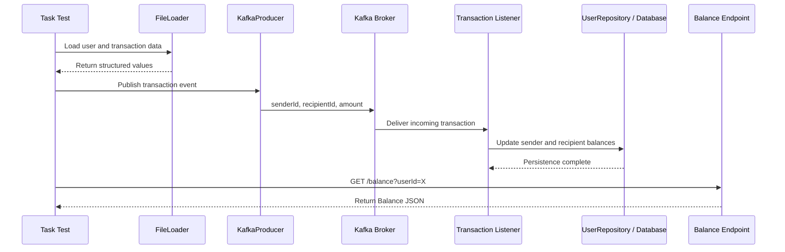

# Midas Core

<div align="center">


</div>

Midas Core is a Spring Boot-based financial transaction processing project created for the JPMC Advanced Software Engineering Forage program. It is designed to model a simple, event-driven payment system in which users have balances, transactions move money between accounts, and those updates are processed through Kafka-style messaging and persisted through a database-backed repository layer.

This repository is primarily an educational challenge project: it includes a runnable Spring Boot application and a set of progressive task tests that guide you through real-world patterns like transaction processing, message-driven workflows, and balance queries.

## Why this project matters

- Learn event-driven processing with Kafka and Spring Boot
- Practice domain modeling and entity persistence with JPA
- Explore transaction logic and account balance updates
- Use progressive task-based tests to validate application behavior
- Build confidence working with real-world backend patterns in Java

## High-level architecture



For a fuller interactive architecture guide with additional diagrams and component relationships, see [docs/ARCHITECTURE.md](docs/ARCHITECTURE.md).

## Project structure

```text
.
├── .mvn/                            # Maven wrapper configuration
├── docs/
│   └── ARCHITECTURE.md             # Architecture overview and Mermaid diagrams
├── src/
│   ├── main/
│   │   └── java/com/jpmc/midascore/
│   │       ├── component/           # application components
│   │       ├── entity/              # JPA entity models
│   │       ├── foundation/          # domain models such as Transaction and Balance
│   │       ├── repository/          # Spring Data repositories
│   │       └── MidasCoreApplication.java
│   └── test/
│       └── java/com/jpmc/midascore/
│           ├── BalanceQuerier.java
│           ├── FileLoader.java
│           ├── KafkaProducer.java
│           ├── TaskOneTests.java
│           ├── TaskTwoTests.java
│           ├── TaskThreeTests.java
│           ├── TaskFourTests.java
│           ├── TaskFiveTests.java
│           ├── UserPopulator.java
│           └── ...
├── src/test/resources/test_data/    # Seed data used by challenge tasks
├── .gitignore
├── application.yml                 # Spring configuration
├── pom.xml                         # Maven build config
├── mvnw                            # Unix shell wrapper
├── mvnw.cmd                        # Windows wrapper
├── README.md
├── services/
│   └── transaction-incentive-api.jar
└── ...
```

## Core components

### Application bootstrap

- [src/main/java/com/jpmc/midascore/MidasCoreApplication.java](src/main/java/com/jpmc/midascore/MidasCoreApplication.java) starts the Spring Boot application.

### User and balance modeling

- [src/main/java/com/jpmc/midascore/entity/UserRecord.java](src/main/java/com/jpmc/midascore/entity/UserRecord.java) represents a user record with a generated ID, name, and current balance.
- [src/main/java/com/jpmc/midascore/foundation/Transaction.java](src/main/java/com/jpmc/midascore/foundation/Transaction.java) models a payment or transfer event between a sender and recipient.
- [src/main/java/com/jpmc/midascore/foundation/Balance.java](src/main/java/com/jpmc/midascore/foundation/Balance.java) represents a balance response payload.

### Persistence layer

- [src/main/java/com/jpmc/midascore/repository/UserRepository.java](src/main/java/com/jpmc/midascore/repository/UserRepository.java) exposes CRUD operations for users.
- [src/main/java/com/jpmc/midascore/component/DatabaseConduit.java](src/main/java/com/jpmc/midascore/component/DatabaseConduit.java) acts as the application-facing persistence helper.

### Testing and challenge flow

The repo includes task-based tests that intentionally guide the implementation process:

- [src/test/java/com/jpmc/midascore/TaskOneTests.java](src/test/java/com/jpmc/midascore/TaskOneTests.java)
- [src/test/java/com/jpmc/midascore/TaskTwoTests.java](src/test/java/com/jpmc/midascore/TaskTwoTests.java)
- [src/test/java/com/jpmc/midascore/TaskThreeTests.java](src/test/java/com/jpmc/midascore/TaskThreeTests.java)
- [src/test/java/com/jpmc/midascore/TaskFourTests.java](src/test/java/com/jpmc/midascore/TaskFourTests.java)
- [src/test/java/com/jpmc/midascore/TaskFiveTests.java](src/test/java/com/jpmc/midascore/TaskFiveTests.java)

These tests load files from [src/test/resources/test_data](src/test/resources/test_data), seed users, publish transaction data, and then validate resulting balance states or API responses.

## Transaction flow



## Getting started

### Prerequisites

- Java 17+
- Maven 3.8+
- A working terminal environment

### Clone the project

```bash
git clone https://github.com/Jasmine0987/forage-midas.git
cd forage-midas
```

### Run the application

```bash
./mvnw spring-boot:run
```

On Windows:

```bash
mvnw.cmd spring-boot:run
```

### Run tests

```bash
./mvnw test
```

Run a specific task test:

```bash
./mvnw test -Dtest=TaskOneTests
```

## Configuration

The project includes a base Spring configuration file at [application.yml](application.yml). This is where properties such as Kafka topic names and general application settings are expected to live.

Example structure:

```yaml
general:
  kafka-topic: transactions
```

## What the code is implementing

This repository provides the scaffold for a simplified digital wallet / transaction engine. The pattern is:

1. Seed users with initial balances
2. Load transaction payloads from test data files
3. Publish transaction events
4. Consume those events and apply balance changes
5. Persist the update to the database
6. Query balances through a REST-style API endpoint

## Support and documentation

- [README.md](README.md) — project overview and quickstart guide
- [docs/ARCHITECTURE.md](docs/ARCHITECTURE.md) — architecture diagrams and implementation notes
- [pom.xml](pom.xml) — Java and Spring dependencies
- [src/test/resources/test_data](src/test/resources/test_data) — challenge data files

## Contributing

This repository is a learning-focused project for the JPMC Advanced Software Engineering Forage program. Contributions are welcome if they improve clarity, fix issues, or extend the functionality in a sensible way.

If you are making a larger change, it is best to start with a focused discussion or issue before creating a substantial implementation.

## License

This project is intended for educational and portfolio use as part of the JPMC Advanced Software Engineering Forage program. See the repository’s license configuration if present.

---

Midas Core is a small but powerful example of how to combine Java, Spring Boot, JPA, and Kafka to model a realistic event-driven financial workflow.
