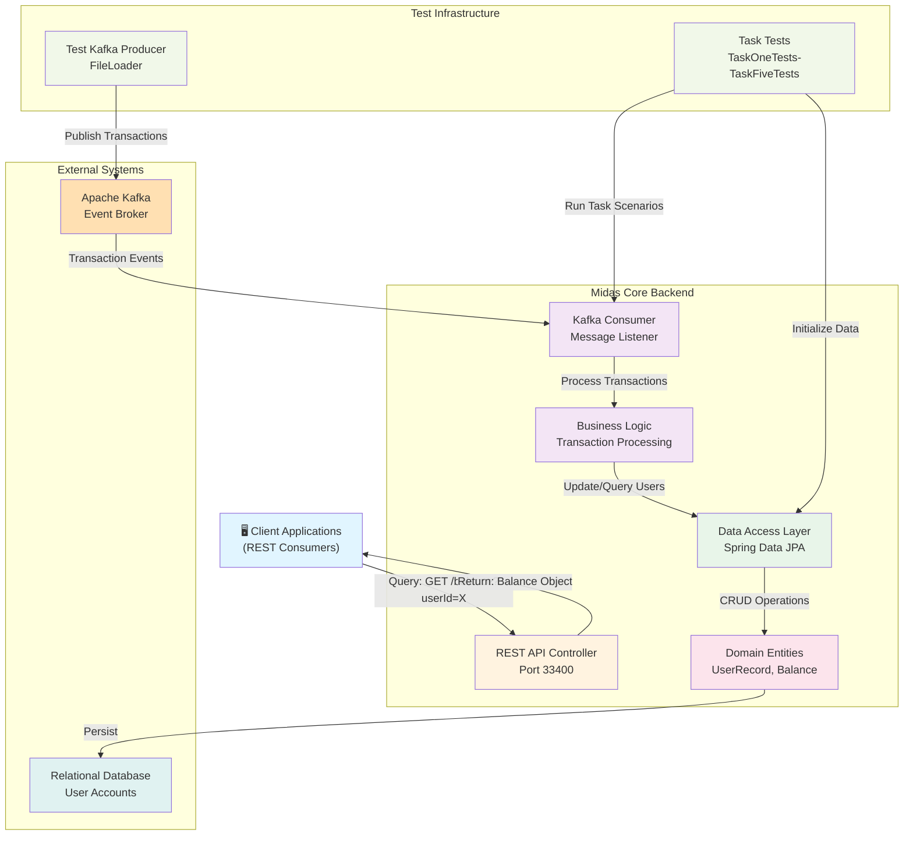
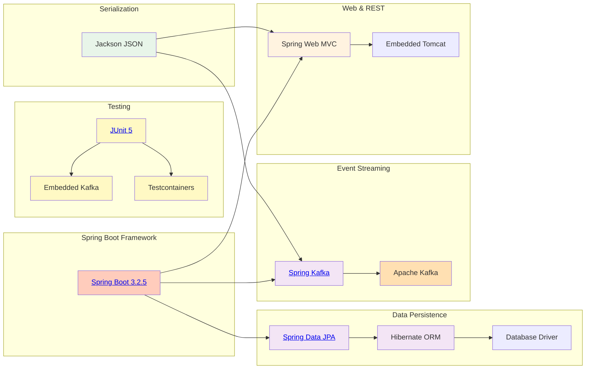
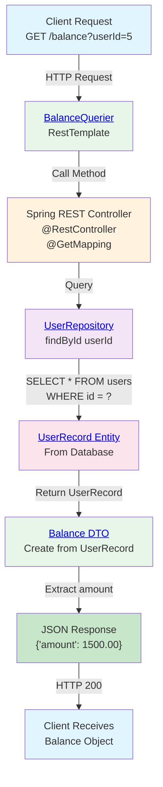
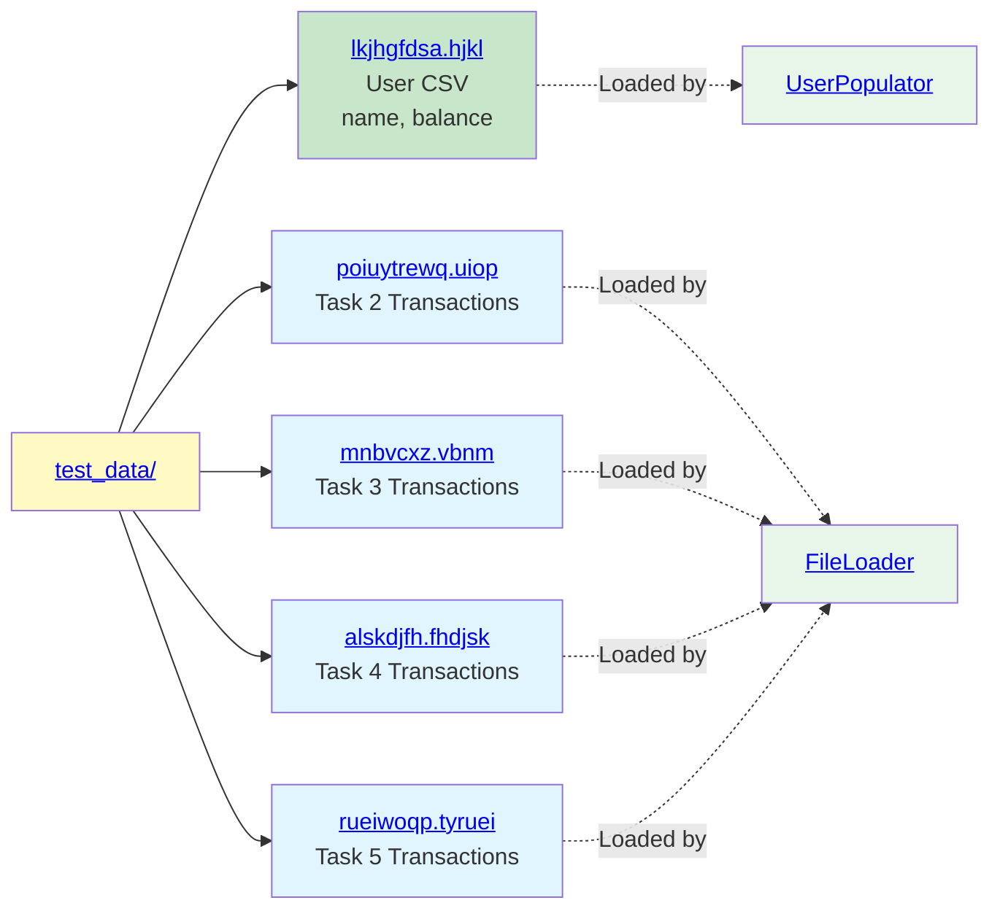
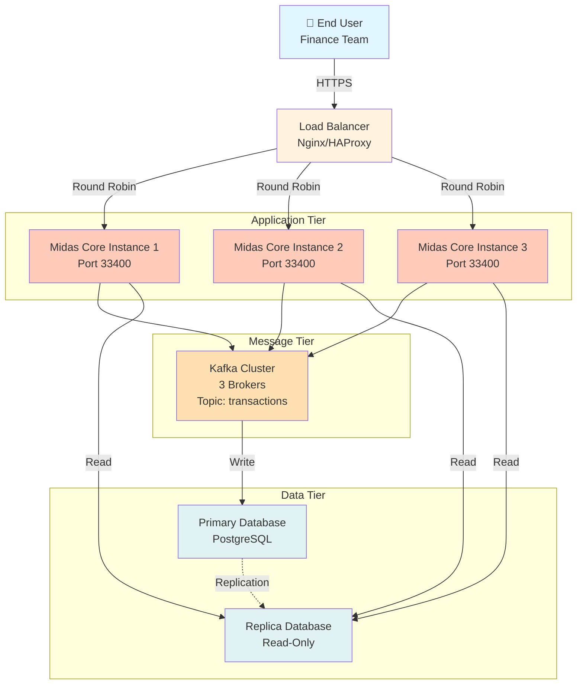

# Midas Core Architecture

This document contains interactive architecture diagrams for the Midas Core project. Click on nodes to navigate to relevant source files.

---

## System Architecture Overview



---

## Project Structure & Components

Click on any component below to navigate to its source file:

```mermaid
graph TD
    Root["📦 forage-midas<br/>Root Directory"]
    
    Root -->|Build Config| POM["<a href='https://github.com/Jasmine0987/forage-midas/blob/flow/pom.xml'>pom.xml</a><br/>Maven Configuration"]
    Root -->|App Config| AppYml["<a href='https://github.com/Jasmine0987/forage-midas/blob/flow/application.yml'>application.yml</a><br/>Spring Properties"]
    Root -->|Docs| README["<a href='https://github.com/Jasmine0987/forage-midas/blob/flow/README.md'>README.md</a><br/>Project Guide"]
    Root -->|Docs| ARCH["<a href='https://github.com/Jasmine0987/forage-midas/blob/flow/docs/ARCHITECTURE.md'>ARCHITECTURE.md</a><br/>This File"]
    
    Root -->|Main Code| SrcMain["src/main/java/com/jpmc/midascore"]
    Root -->|Tests| SrcTest["src/test/java/com/jpmc/midascore"]
    
    SrcMain -->|Entry Point| App["<a href='https://github.com/Jasmine0987/forage-midas/blob/flow/src/main/java/com/jpmc/midascore/MidasCoreApplication.java'>MidasCoreApplication.java</a><br/>🚀 Spring Boot App"]
    
    SrcMain -->|Entities| EntityDir["entity/"]
    EntityDir -->|User Model| UserEntity["<a href='https://github.com/Jasmine0987/forage-midas/blob/flow/src/main/java/com/jpmc/midascore/entity/UserRecord.java'>UserRecord.java</a><br/>@Entity JPA Model"]
    
    SrcMain -->|Repositories| RepoDir["repository/"]
    RepoDir -->|Database Access| UserRepo["<a href='https://github.com/Jasmine0987/forage-midas/blob/flow/src/main/java/com/jpmc/midascore/repository/UserRepository.java'>UserRepository.java</a><br/>CrudRepository"]
    
    SrcMain -->|Components| CompDir["component/"]
    CompDir -->|Database Layer| DbConduit["<a href='https://github.com/Jasmine0987/forage-midas/blob/flow/src/main/java/com/jpmc/midascore/component/DatabaseConduit.java'>DatabaseConduit.java</a><br/>Persistence Abstraction"]
    
    SrcMain -->|Domain Models| FoundDir["foundation/"]
    FoundDir -->|Transaction Model| TxnModel["<a href='https://github.com/Jasmine0987/forage-midas/blob/flow/src/main/java/com/jpmc/midascore/foundation/Transaction.java'>Transaction.java</a><br/>Transfer DTO"]
    FoundDir -->|Balance Model| BalModel["<a href='https://github.com/Jasmine0987/forage-midas/blob/flow/src/main/java/com/jpmc/midascore/foundation/Balance.java'>Balance.java</a><br/>Balance Response"]
    
    SrcTest -->|Learning Tasks| TaskDir["Task Tests"]
    TaskDir -->|Task 1: Boot| T1["<a href='https://github.com/Jasmine0987/forage-midas/blob/flow/src/test/java/com/jpmc/midascore/TaskOneTests.java'>TaskOneTests.java</a><br/>✓ App Boots"]
    TaskDir -->|Task 2: Kafka| T2["<a href='https://github.com/Jasmine0987/forage-midas/blob/flow/src/test/java/com/jpmc/midascore/TaskTwoTests.java'>TaskTwoTests.java</a><br/>🔍 Monitor Messages"]
    TaskDir -->|Task 3: Balance| T3["<a href='https://github.com/Jasmine0987/forage-midas/blob/flow/src/test/java/com/jpmc/midascore/TaskThreeTests.java'>TaskThreeTests.java</a><br/>📊 Track Updates"]
    TaskDir -->|Task 4: State| T4["<a href='https://github.com/Jasmine0987/forage-midas/blob/flow/src/test/java/com/jpmc/midascore/TaskFourTests.java'>TaskFourTests.java</a><br/>🗂️ Inspect DB"]
    TaskDir -->|Task 5: API| T5["<a href='https://github.com/Jasmine0987/forage-midas/blob/flow/src/test/java/com/jpmc/midascore/TaskFiveTests.java'>TaskFiveTests.java</a><br/>📡 Query Endpoint"]
    
    SrcTest -->|Utilities| UtilDir["Test Utilities"]
    UtilDir -->|File Loading| FileLoader["<a href='https://github.com/Jasmine0987/forage-midas/blob/flow/src/test/java/com/jpmc/midascore/FileLoader.java'>FileLoader.java</a><br/>Load Test Data"]
    UtilDir -->|Kafka Publish| KafkaProd["<a href='https://github.com/Jasmine0987/forage-midas/blob/flow/src/test/java/com/jpmc/midascore/KafkaProducer.java'>KafkaProducer.java</a><br/>Send Events"]
    UtilDir -->|DB Seeding| UserPop["<a href='https://github.com/Jasmine0987/forage-midas/blob/flow/src/test/java/com/jpmc/midascore/UserPopulator.java'>UserPopulator.java</a><br/>Seed Users"]
    UtilDir -->|API Testing| BalQuery["<a href='https://github.com/Jasmine0987/forage-midas/blob/flow/src/test/java/com/jpmc/midascore/BalanceQuerier.java'>BalanceQuerier.java</a><br/>HTTP Client"]
    
    style Root fill:#fff9c4
    style POM fill:#e1f5ff
    style AppYml fill:#e1f5ff
    style README fill:#c8e6c9
    style ARCH fill:#c8e6c9
    style App fill:#ffccbc
    style UserEntity fill:#fce4ec
    style UserRepo fill:#f3e5f5
    style DbConduit fill:#f3e5f5
    style TxnModel fill:#e8f5e9
    style BalModel fill:#e8f5e9
    style T1 fill:#fff9c4,stroke:#fbc02d,stroke-width:2px
    style T2 fill:#fff9c4,stroke:#fbc02d,stroke-width:2px
    style T3 fill:#fff9c4,stroke:#fbc02d,stroke-width:2px
    style T4 fill:#fff9c4,stroke:#fbc02d,stroke-width:2px
    style T5 fill:#fff9c4,stroke:#fbc02d,stroke-width:2px
    style FileLoader fill:#e8f5e9
    style KafkaProd fill:#e8f5e9
    style UserPop fill:#e8f5e9
    style BalQuery fill:#e8f5e9
```



---

## Data Flow: Transaction Processing Pipeline

```mermaid
sequenceDiagram
    participant Test as TaskTest<br/>Scenario
    participant FL as FileLoader<br/>Load CSV
    participant KP as KafkaProducer<br/>Publish
    participant KB as Kafka Broker<br/>Topic
    participant KL as Kafka Listener<br/>Consumer
    participant SVC as Transaction<br/>Service
    participant DC as DatabaseConduit<br/>Persist
    participant DB as Database<br/>UserRecord
    participant REST as REST API<br/>Balance Endpoint

    Test->>FL: Load transaction data<br/>from test_data/
    FL-->>Test: Return String[] lines
    
    Test->>KP: Send transaction<br/>senderId, recipientId, amount
    KP->>KB: Publish Transaction<br/>to Kafka Topic
    
    KB->>KL: Deliver event to listener
    KL->>SVC: Process transaction<br/>Debit sender, credit recipient
    
    SVC->>DC: Save updated<br/>UserRecords
    DC->>DB: UPDATE balance<br/>WHERE user_id IN (sender, recipient)
    DB-->>DC: Rows updated
    
    DC-->>SVC: Operation complete
    SVC-->>KL: Acknowledge event
    
    Test->>REST: GET /balance?userId=X
    REST->>DB: SELECT balance<br/>FROM users WHERE id=X
    DB-->>REST: Return balance row
    REST-->>Test: JSON Balance object
    
    Test->>Test: Assert balance<br/>matches expected value

    style Test fill:#fff9c4
    style FL fill:#e8f5e9
    style KP fill:#e8f5e9
    style KB fill:#ffe0b2
    style KL fill:#f3e5f5
    style SVC fill:#f3e5f5
    style DC fill:#e8f5e9
    style DB fill:#e0f2f1
    style REST fill:#fff3e0
```

---

## Component Dependencies



---

## Task Progression Flow

```mermaid
graph TB
    Start["🟢 START<br/>Clone Repository"]
    
    T1["<a href='https://github.com/Jasmine0987/forage-midas/blob/flow/src/test/java/com/jpmc/midascore/TaskOneTests.java'>Task 1: Application Boot</a><br/>Verify Spring Boot app starts"]
    T1Out["✓ Output: Power calculations<br/>0, 1, 1, 4, 25, ..."]
    
    T2["<a href='https://github.com/Jasmine0987/forage-midas/blob/flow/src/test/java/com/jpmc/midascore/TaskTwoTests.java'>Task 2: Observe Kafka</a><br/>Watch transaction messages<br/>Load from test_data/poiuytrewq.uiop"]
    T2Out["🔍 Use debugger to find:<br/>Transaction(senderId, recipientId, amount)"]
    
    T3["<a href='https://github.com/Jasmine0987/forage-midas/blob/flow/src/test/java/com/jpmc/midascore/TaskThreeTests.java'>Task 3: Trace Balance Update</a><br/>Process transactions via Kafka<br/>Load users from test_data/lkjhgfdsa.hjkl<br/>Load txns from test_data/mnbvcxz.vbnm"]
    T3Out["🎯 Find: Waldorf's balance<br/>after transaction processing"]
    
    T4["<a href='https://github.com/Jasmine0987/forage-midas/blob/flow/src/test/java/com/jpmc/midascore/TaskFourTests.java'>Task 4: Inspect Database State</a><br/>Populate database with users<br/>Process more transactions<br/>Load txns from test_data/alskdjfh.fhdjsk"]
    T4Out["📊 Find: Wilbur's balance<br/>after all transactions complete"]
    
    T5["<a href='https://github.com/Jasmine0987/forage-midas/blob/flow/src/test/java/com/jpmc/midascore/TaskFiveTests.java'>Task 5: Query REST API</a><br/>Implement /balance endpoint<br/>Process final transactions<br/>Load txns from test_data/rueiwoqp.tyruei"]
    T5Out["📡 Query: GET /balance?userId=X<br/>Return all user balances (0-12)"]
    
    End["🏁 COMPLETE<br/>All tasks verified"]
    
    Start --> T1
    T1 --> T1Out
    T1Out --> T2
    T2 --> T2Out
    T2Out --> T3
    T3 --> T3Out
    T3Out --> T4
    T4 --> T4Out
    T4Out --> T5
    T5 --> T5Out
    T5Out --> End
    
    style Start fill:#c8e6c9,stroke:#388e3c,stroke-width:3px
    style T1 fill:#fff9c4,stroke:#fbc02d,stroke-width:2px
    style T1Out fill:#fff3e0
    style T2 fill:#fff9c4,stroke:#fbc02d,stroke-width:2px
    style T2Out fill:#fff3e0
    style T3 fill:#fff9c4,stroke:#fbc02d,stroke-width:2px
    style T3Out fill:#fff3e0
    style T4 fill:#fff9c4,stroke:#fbc02d,stroke-width:2px
    style T4Out fill:#fff3e0
    style T5 fill:#fff9c4,stroke:#fbc02d,stroke-width:2px
    style T5Out fill:#fff3e0
    style End fill:#c8e6c9,stroke:#388e3c,stroke-width:3px
```



---

## Request-Response Cycle: REST API Balance Query



---

## Event Processing: Kafka Transaction Consumer

```mermaid
graph LR
    subgraph "Kafka Topic: transactions"
        M1["Event: Transaction<br/>senderId=1<br/>recipientId=2<br/>amount=100"]
        M2["Event: Transaction<br/>senderId=2<br/>recipientId=3<br/>amount=50"]
    end
    
    Listener["<a href='https://github.com/Jasmine0987/forage-midas/blob/flow/src/test/java/com/jpmc/midascore/KafkaProducer.java'>@KafkaListener</a><br/>Consumer"]
    
    Process["Transaction Logic<br/>1. Find sender user<br/>2. Debit sender balance<br/>3. Find recipient user<br/>4. Credit recipient balance"]
    
    Persist["<a href='https://github.com/Jasmine0987/forage-midas/blob/flow/src/main/java/com/jpmc/midascore/component/DatabaseConduit.java'>DatabaseConduit</a><br/>Save both UserRecords"]
    
    DB["Database<br/>UserRecord Table"]
    
    M1 --> Listener
    M2 --> Listener
    Listener -->|Parse Transaction| Process
    Process -->|Persist Changes| Persist
    Persist -->|UPDATE users<br/>SET balance = ...<br/>WHERE id IN (1, 2, 3)| DB
    
    style M1 fill:#ffe0b2
    style M2 fill:#ffe0b2
    style Listener fill:#f3e5f5
    style Process fill:#f3e5f5
    style Persist fill:#e8f5e9
    style DB fill:#e0f2f1
```

---

## Test Data Files Reference



---

## Deployment Architecture (Conceptual)



---

## Key Implementation Areas

### 1. REST Endpoint Implementation
**File**: `src/main/java/com/jpmc/midascore/` (create Controller if not exists)
- Create `@RestController` class
- Implement `@GetMapping("/balance")` endpoint
- Accept `userId` query parameter
- Use `UserRepository.findById()` to fetch user
- Convert to `Balance` DTO and return

### 2. Kafka Consumer Implementation
**File**: `src/main/java/com/jpmc/midascore/` (create Consumer/Listener if not exists)
- Create `@Component` class with `@KafkaListener`
- Listen on topic from `${general.kafka-topic}`
- Deserialize incoming `Transaction` messages
- Apply transaction logic:
  - Find sender and recipient users
  - Debit sender balance
  - Credit recipient balance
- Use `DatabaseConduit.save()` to persist

### 3. Transaction Logic
**Location**: Same as Kafka Consumer
```java
Transaction debit: sender.setBalance(sender.getBalance() - transaction.getAmount());
Transaction credit: recipient.setBalance(recipient.getBalance() + transaction.getAmount());
databaseConduit.save(sender);
databaseConduit.save(recipient);
```

### 4. Configuration
**File**: `application.yml`
```yaml
general:
  kafka-topic: transactions
spring:
  kafka:
    bootstrap-servers: localhost:9092
  jpa:
    hibernate:
      ddl-auto: update
```

---

## Quick Navigation

| Component | File | Purpose |
|-----------|------|---------|
| **Entry Point** | [MidasCoreApplication.java](https://github.com/Jasmine0987/forage-midas/blob/flow/src/main/java/com/jpmc/midascore/MidasCoreApplication.java) | Spring Boot bootstrap |
| **User Entity** | [UserRecord.java](https://github.com/Jasmine0987/forage-midas/blob/flow/src/main/java/com/jpmc/midascore/entity/UserRecord.java) | JPA entity for users |
| **Repository** | [UserRepository.java](https://github.com/Jasmine0987/forage-midas/blob/flow/src/main/java/com/jpmc/midascore/repository/UserRepository.java) | Database access |
| **Persistence** | [DatabaseConduit.java](https://github.com/Jasmine0987/forage-midas/blob/flow/src/main/java/com/jpmc/midascore/component/DatabaseConduit.java) | Data layer abstraction |
| **Models** | [Transaction.java](https://github.com/Jasmine0987/forage-midas/blob/flow/src/main/java/com/jpmc/midascore/foundation/Transaction.java) | Event model |
| | [Balance.java](https://github.com/Jasmine0987/forage-midas/blob/flow/src/main/java/com/jpmc/midascore/foundation/Balance.java) | Response model |
| **Test Suite** | [Task*Tests.java](https://github.com/Jasmine0987/forage-midas/tree/flow/src/test/java/com/jpmc/midascore) | Learning tasks 1-5 |
| **Config** | [pom.xml](https://github.com/Jasmine0987/forage-midas/blob/flow/pom.xml) | Maven dependencies |
| | [application.yml](https://github.com/Jasmine0987/forage-midas/blob/flow/application.yml) | Spring properties |
| **Docs** | [README.md](https://github.com/Jasmine0987/forage-midas/blob/flow/README.md) | Project overview |

---

**Last Updated**: October 2026  
**Project**: Midas Core - JPMC Forage Program
